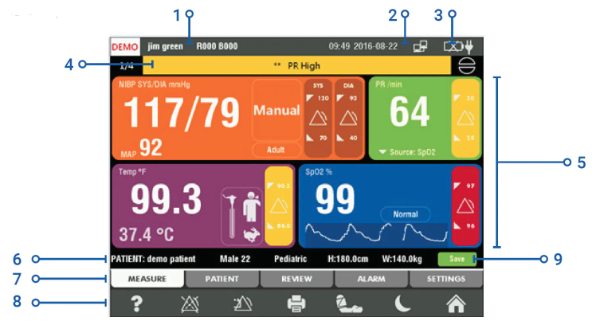
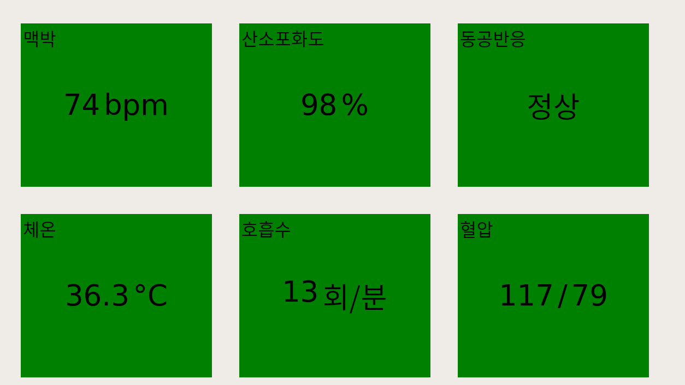

# PyQt5

> 성균관대학교 지능시스템연구소에서 인턴활동을 하며 공부하는 PyQt5에 대한 기록

기간 : 7월 5일 ~
목적 : Vital Signs GUI 구축
기관 : 성균관대학교 지능시스템연구소 [ISRI]
마음가짐 : 짧고 굷게

**< 목표 디자인 >**  

설명

1. 임상의 정보
   참고: 모니터링 모드에서 환자를 선택하기 전에 임상의에 로그인해야 합니다.
2. 시스템 시간, 날짜 및 네트워크 상태
3. 배터리 상태
4. 장치 경보 메시지 표시줄
5. 측정 표시 영역
6. 환자 정보
7. 메뉴 탭: 장치 메뉴를 탐색합니다.  
   a) 측정: 활력 징후 매개변수를 표시합니다.  
   b) 환자  
   c) reVIEW: 과거 환자 데이터.  
   d) ALARM: 알람 매개변수 조정  
   e) 설정
8. 바로 가기 아이콘  
   a) 도움말 키  
   b) 알람 일시 중지 키  
   c) 알람 재설정 단축키  
   d) 인쇄할 바로 가기 키  
   e) NIBP 측정 시작/중지 단축키  
   f) 대기 모드 바로 가기 키  
   g) 홈 화면 바로 가기 키
9. 저장 아이콘: 현재 환자에 대한 현재 측정 데이터를 저장하려면 누릅니다.

Read more: https://ko.manuals.plus/suntech/vital-signs-monitor-ct50-manual#ixzz7Yz1OyvB9

**<원래 디자인>**

**<Keyward>**

- QGroupBox()
- set

**<변경 사항>**

- 블럭 색상 [참고: https://m.blog.naver.com/hellonami/30189427178] - [X]
- 이미지 삽입 - [X]
- sign이 정상범위를 벗어났을 경우 블럭 색상 변화 - [X]
- 절대적 배치 -> 박스 레이아웃으로 변경
- 창 크기 최대화 - [X]
- 타이틀 바 제거 - [X]
- 키 입력받아 창 크기 변경 및 창 닫기(f,n,esc) - [X]

**추가 기능**

- 블럭 화면 터치시 그래프 화면으로 전환
- 그래프화면에서 터치시 다시 블럭 화면으로 전환
- 툴바 생성 -> 현재 이미지 저장(프린트)/로그 보기/

**<학습 자료>**

- https://wikidocs.net/book/2165

| 주제     | Task        | 링크 |
| -------- | ----------- | ---- |
| **소개** | 테스트2     |      |
| **설치** |             |      |
| **기초** | 창 띄우기   |      |
|          | 아이콘 삽입 |      |
|          | 창 닫기     |      |
|          | 창 띄우기   |      |
|          | 창 띄우기   |      |
|          | 창 띄우기   |      |
|          | 창 띄우기   |      |

aa
s
