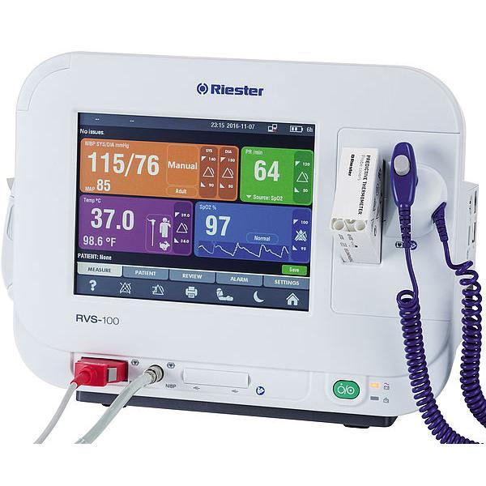

# PyQt5

> 성균관대학교 지능시스템연구소에서 인턴활동을 하며 공부하는 PyQt5에 대한 기록

기간 : 7월 5일 ~
목적 : Vital Signs GUI 구축
기관 : 성균관대학교 지능시스템연구소 [ISRI]
마음가짐 : 짧고 굷게

**< 목표 디자인 >**

**<Keyward>**

- QGroupBox()
- set

**추가 기능**

- 블럭 화면 터치시 그래프 화면으로 전환
- 그래프화면에서 터치시 다시 블럭 화면으로 전환
- 툴바 생성 -> 현재 이미지 저장(프린트)/로그 보기/

**<학습 자료>**

- https://wikidocs.net/book/2165

| 주제     | Task        | 링크 |
| -------- | ----------- | ---- |
| **소개** | 테스트2     |      |
| **설치** |             |      |
| **기초** | 창 띄우기   |      |
|          | 아이콘 삽입 |      |
|          | 창 닫기     |      |
|          | 창 띄우기   |      |
|          | 창 띄우기   |      |
|          | 창 띄우기   |      |
|          | 창 띄우기   |      |

aa
s
